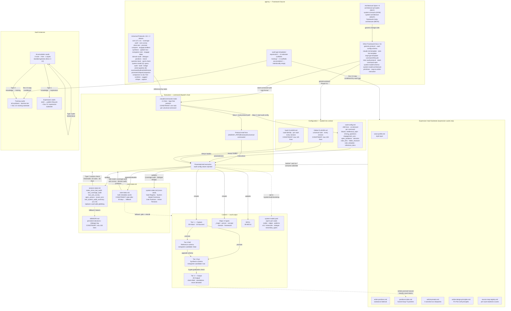
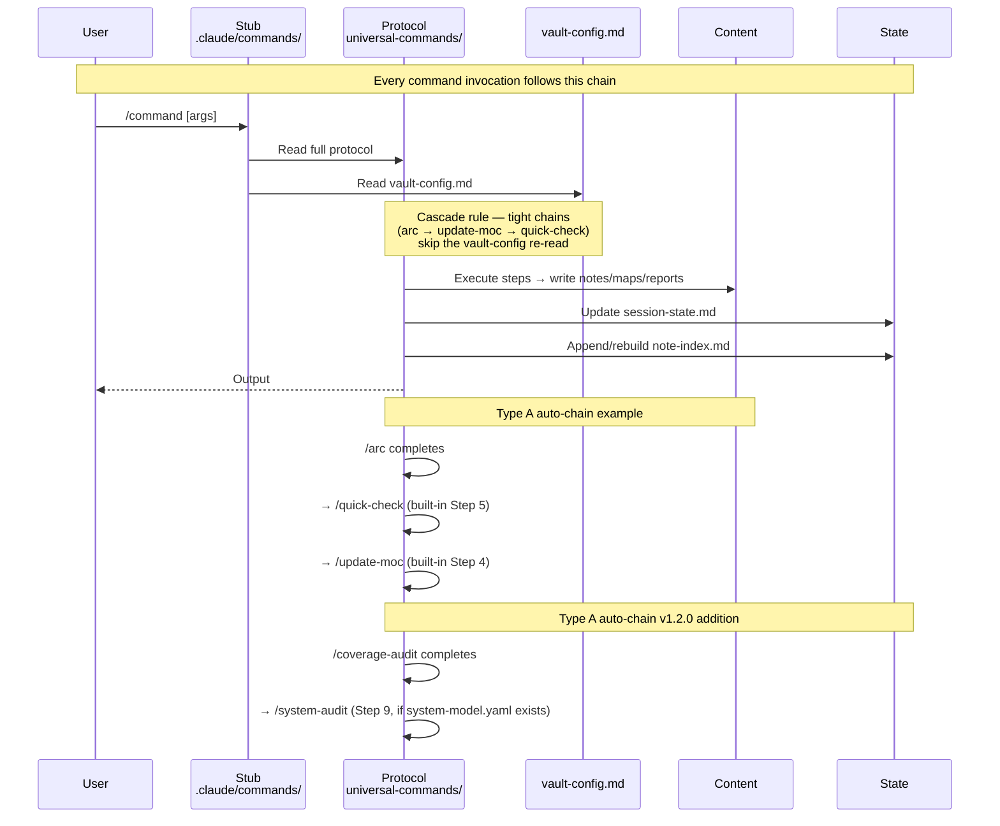
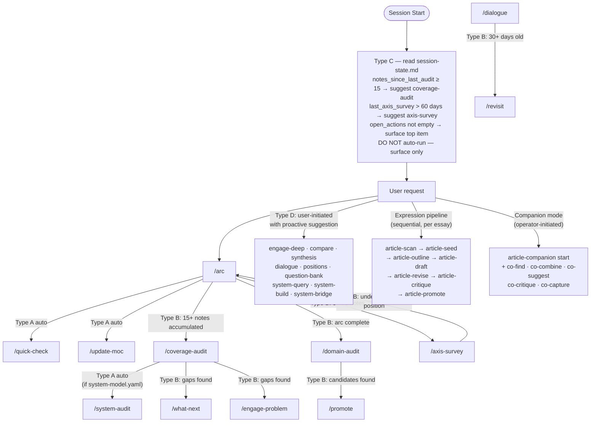
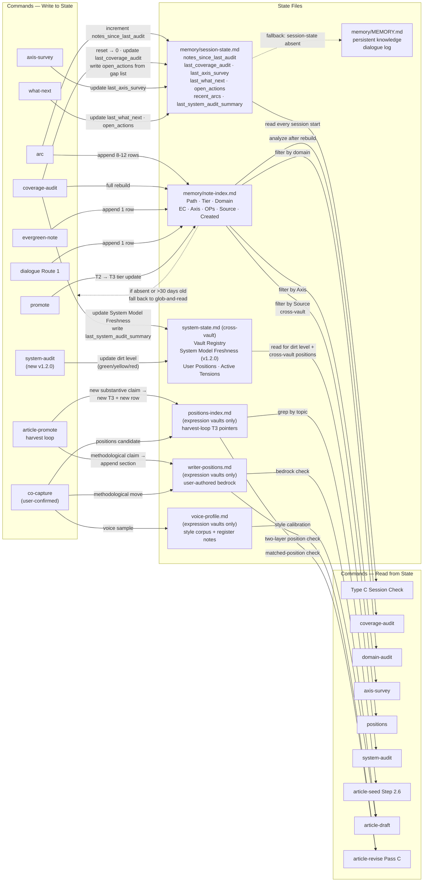

---
type: reference
stability_tier: foundational
canonicity: derived
derives_from: [framework/principles/system-architecture.md]
audience: human
---

# System Diagrams

Visual companion to `system-architecture.md`. The canonical form of the framework's topology is the YAML manifest in `system-architecture.md`; the diagrams here render the same structure for human orientation. Claude does not need to read this file to reason about the framework — the YAML manifest carries the same information in structured form.

**Reading order for framework-change work**: `architecture-principles.md` (WHY — invariants) → `system-contracts.md` (HOW — contract table) → `system-architecture.md` (WHAT — YAML manifest) → `framework-meta-architecture.md` (META — doc system). This file is *not* in the reading chain; open it when you want to see the system visually.

**View in Obsidian** for rendered Mermaid.

---

## Diagram 1 — Complete System Map

Every major component and the relationships between them. Subgraphs group by functional layer. Constraints are annotated at the relevant edges and nodes.

**Key constraints visible in the diagram**:
- Global CLAUDE.md is capped at 100 lines — every line is paid in every session everywhere.
- vault-config.md is read fresh per command (cascade exception: chained sub-commands skip re-read).
- Tier promotion is one-way; T3 notes are never moved back.
- Protocol logic lives once in agensy; vault stubs are pure pointers.
- The expression-vault substrate is a separate layer that only expression vaults consume.
- `system-model.yaml` is opt-in per vault; `/coverage-audit` auto-fires `/system-audit` when it exists.

---

## Diagram 2 — Command Dispatch & Lifecycle

How a command goes from user invocation to completion, and how the four trigger types chain together.

---

## Diagram 3 — State Management & Feedback Loops

Every read and write relationship between commands and the state files. Dashed edges are fallback paths. New in v1.2.0: `/coverage-audit` Step 9 auto-fires `/system-audit`; expression-vault substrate writes via `/article-promote` harvest loop and `/co-capture`.

---

## Diagram 4 — Genesis Protocol

How a new vault is bootstrapped from scratch. Each phase depends on the prior phase's complete output. **v1.2.0 adds Doc 13** — a conditional vault-type substrate step.

```mermaid
graph TD
    P0["Phase 0 — Config Elicitation<br/>Claude asks Q0.5→Q7 in sequence<br/>Q0.5: Intellectual style preset<br/>Q1: Mission · Q2: Driving questions<br/>Q3: Engagement axis · Q4: Open problems 8-15<br/>Q5: Note tier structure · Q6: Domains 3-12<br/>Q7: Output layer (vault type determined)<br/>▶ Output: vault-config.md"]

    P1["Phase 1 — Document Generation<br/>Claude generates in dependency order:<br/>Doc 1: Folder structure<br/>Doc 2: CLAUDE.md<br/>Doc 3: note-taxonomy.md<br/>Doc 4: development-plan.md<br/>Doc 5: coverage-plan.md<br/>Doc 6: map-reference.md<br/>Doc 7: Domain primers → _maps/<br/>Doc 8: Initial MOCs → 30-MOCs/<br/>Doc 9: Stubs → .claude/commands/<br/>Doc 10: open-problems.md<br/>Doc 11: vault-config.md extensions<br/>Doc 12: memory/ initialization<br/>▶ Output: 12 universal documents"]

    P1B["Phase 1 Doc 13 (conditional, v1.2.0)<br/>Vault-Type Substrate Copy<br/>IF expression → copy vault-type-templates/expression/*<br/>(voice-profile · writer-positions · positions-index<br/>article-presets · article-design-principles<br/>source-map-registry)<br/>IF training → copy vault-type-templates/training/*<br/>(curriculum · postulates · sources-master-list)<br/>IF accumulation → skip<br/>▶ Output: vault-type substrate in vault root"]

    P2["Phase 2 — Self-Audit Initialization<br/>Run /coverage-audit as baseline test<br/>Verify: 0 notes · all primers present<br/>all MOCs present · no structural gaps<br/>▶ Output: baseline coverage-plan.md"]

    P3["Phase 3 — First Content Arc<br/>Run /arc on core-priority domain<br/>Target: most central to engagement axis<br/>Success criteria: 1 map + 8-12 T2 notes<br/>≥2 open problems referenced<br/>engagement axis field in every synthesis note<br/>≥3 cross-domain links<br/>▶ Output: calibrated framework"]

    P4["Phase 4 — Ongoing Self-Regulation<br/>Standing mechanisms replace project management:<br/>/coverage-audit every 10-15 new notes<br/>→ auto-fires /system-audit (if system-model.yaml)<br/>/what-next at session start when intent unclear<br/>/axis-survey every 2-3 months<br/>▶ Output: maintained growing vault"]

    P0 -->|"vault-config.md complete<br/>all questions answered"| P1
    P1 -->|"12 universal docs complete"| P1B
    P1B -->|"substrate copied<br/>(or skipped for accumulation)"| P2
    P2 -->|"structure validated"| P3
    P3 -->|"calibration successful"| P4

    P2 -.->|"structural errors<br/>fix before Phase 3"| P1
    P3 -.->|"schema problems<br/>fix vault-config + CLAUDE.md"| P1
```

---

## See Also

- `framework/principles/system-architecture.md` — canonical YAML manifest (source of truth for topology)
- `framework/principles/architecture-principles.md` — invariants and change-analysis protocol
- `framework/principles/system-contracts.md` — contract table (command → required vault-config keys)
- `framework/principles/framework-meta-architecture.md` — document taxonomy, stability tiers, canonicity, supersession
