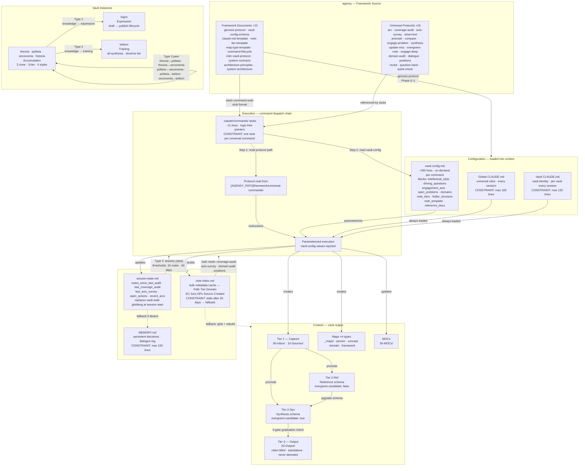
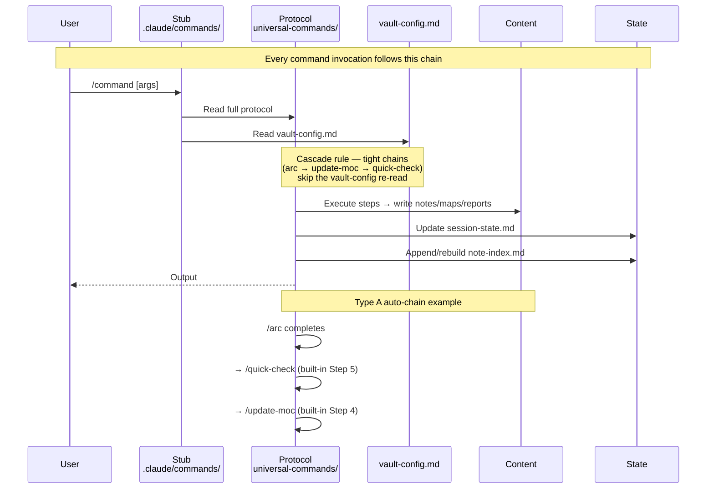
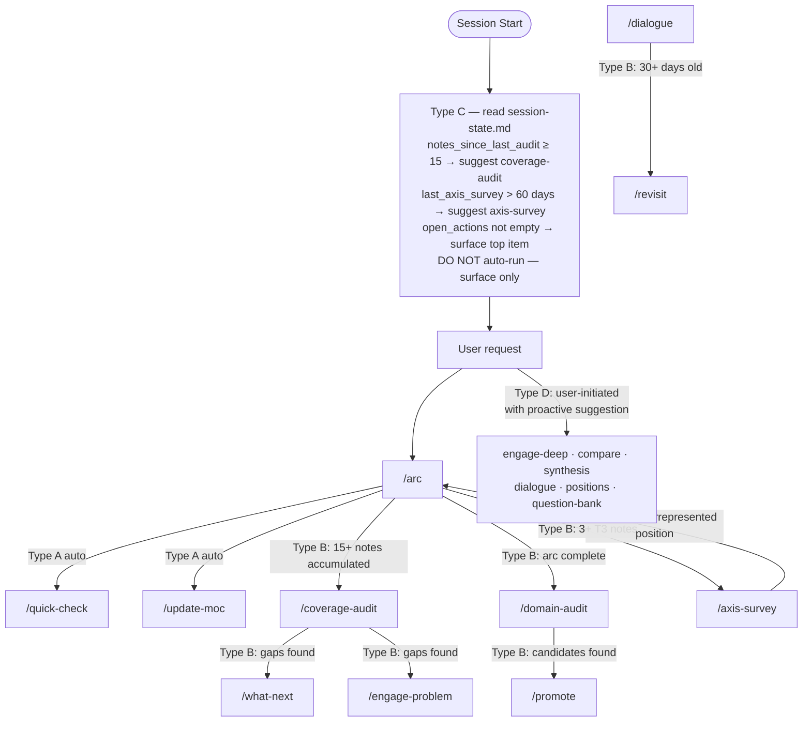
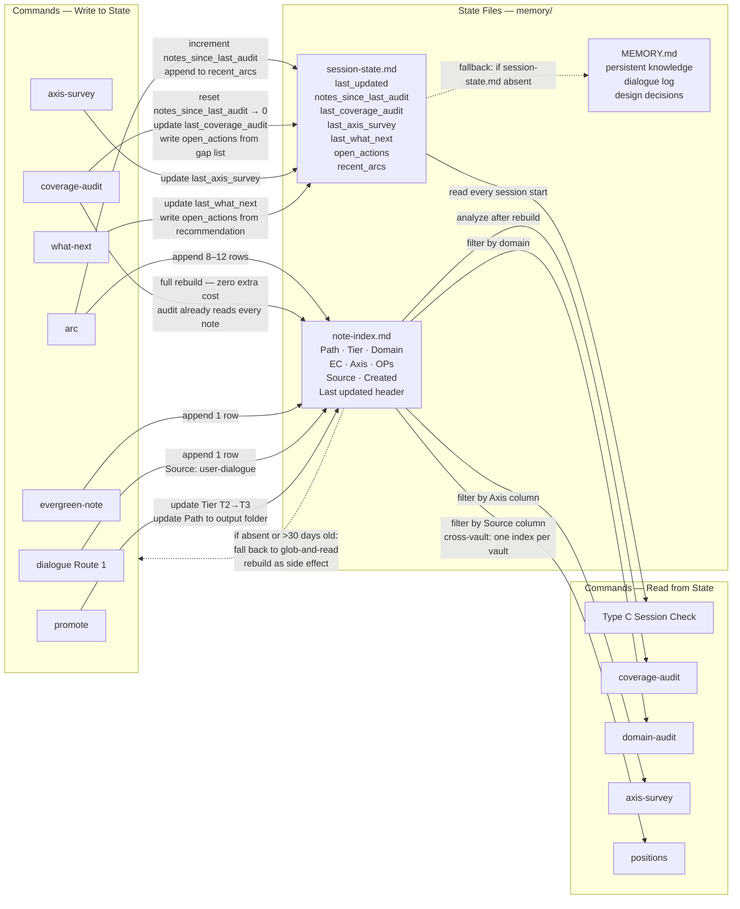
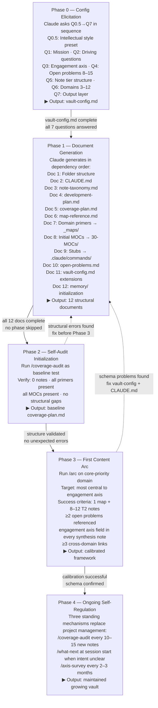

---
type: reference
audience: claude
---
# System Architecture

**Reading order**: `architecture-principles.md` (WHY — invariants + change protocol) → `system-contracts.md` (HOW — contract table) → `system-architecture.md` (WHAT — topology and YAML manifest, read here last)

Visual and structured descriptions of the complete agensy framework. Two representations of the same system: Mermaid diagrams for human viewing in Obsidian; YAML manifest for Claude's structured analysis.

**How to use**:
- **Human**: view this file in Obsidian to see the rendered diagrams
- **Claude**: read the YAML manifest at the end for precise component metadata and relationship data before analyzing the architecture

---

## Diagram 1 — Complete System Map

Every major component and the relationships between them. Subgraphs group by functional layer. Constraints are annotated at the relevant edges and nodes.



**Key constraints visible in the diagram**:
- Global CLAUDE.md is capped at 100 lines — every line is paid in every session everywhere
- vault-config.md is read fresh per command (cascade exception: chained sub-commands skip re-read)
- Tier promotion is one-way; T3 notes are never moved back
- Protocol logic lives once in agensy; vault stubs are pure pointers

---

## Diagram 2 — Command Dispatch & Lifecycle

How a command goes from user invocation to completion, and how the four trigger types chain together.





---

## Diagram 3 — State Management & Feedback Loops

Every read and write relationship between commands and the three memory files. Dashed edges are fallback paths.



---

## Diagram 4 — Genesis Protocol

How a new vault is bootstrapped from scratch. Each phase depends on the prior phase's complete output.



---

## YAML System Manifest

Machine-readable description of the complete framework. Mermaid diagrams above show topology; this manifest shows full component metadata. **Claude reads this for precise analysis** — every relationship and constraint is explicit.

```yaml
# ── Synthesis-Meta System Manifest ──────────────────────────────────────────
# Version: 2026-03-30
# Source of truth for: component metadata, command-to-key relationships,
# state file ownership, lifecycle thresholds, structural constraints.
# Mermaid diagrams above show the same system visually.

loading_hierarchy:
  layer_1_global:
    file: "~/.claude/CLAUDE.md"
    scope: "all vaults, every session"
    budget_lines: 100
    contains:
      - core_principles       # atomic, evergreen, strong-linking, no-duplication, project-facing
      - two_zone_architecture # reference substrate vs synthesis core concept
      - three_tier_logic      # promotion rules, graduation direction
      - slash_command_runtime # stub→protocol dispatch instructions
      - tool_skill_rules      # obsidian-markdown, defuddle, obsidian-cli
      - memory_management     # MEMORY.md rules, what to save/not save

  layer_2_vault:
    file: "{vault}/CLAUDE.md"
    scope: "per vault, every session"
    budget_lines: 120
    contains:
      - role_statement
      - mission
      - vault_structure        # folder listing
      - driving_questions      # q1, q2, q3
      - engagement_axis_summary
      - open_problems_list
      - domain_defaults_table  # Two-Zone Architecture per domain
      - note_schema_summary    # mandatory sections for this vault
      - vault_specific_commands

  layer_3_ondemand:
    vault_config:
      file: "{vault}/vault-config.md"
      size_lines: "~260"
      loaded: "per command invocation"
      cascade_rule: "chained sub-commands skip re-read if parent already loaded"
      blocks:
        intellectual_style:
          subkeys: [preset, engagement_axis, engagement_field, pressure_points,
                    internal_tensions, dialogue_philosophy, graduated_depth]
          consumers: [arc, axis-survey, promote, compare, engage-problem, synthesis,
                      engage-deep, domain-audit, quick-check, dialogue, revisit,
                      evergreen-note]
        driving_questions:
          consumers: [synthesis, engage-deep, dialogue]
        engagement_axis:
          subkeys: [config_key, statement, positions, label]
          consumers: [arc, axis-survey, promote, compare, engage-problem, synthesis,
                      engage-deep, quick-check, dialogue, revisit, evergreen-note]
        open_problems:
          subkeys: [id, name, question, status]
          count_range: [8, 15]
          consumers: [arc, coverage-audit, what-next, compare, engage-problem, synthesis,
                      engage-deep, quick-check, dialogue, revisit, evergreen-note]
        domains:
          subkeys: [slug, label, folder, priority, evergreen_candidate]
          count_range: [3, 12]
          consumers: [arc, coverage-audit, axis-survey, what-next, compare,
                      engage-problem, synthesis, update-moc, domain-audit, quick-check]
        note_tiers:
          subkeys: [tier1, tier2, tier3]  # each: type_value, graduation_rule, output_folder
          consumers: [arc, coverage-audit, promote, domain-audit]
        folder_structure:
          subkeys: [inbox, sources, output, mocs, templates, maps, memory, commands]
          consumers: [arc, coverage-audit, promote, update-moc, domain-audit,
                      quick-check, dialogue, revisit, evergreen-note]
        note_template:
          subkeys: [synthesis, reference]  # each: mandatory_sections, additional_frontmatter
          consumers: [arc, promote, domain-audit, quick-check, dialogue, evergreen-note]
        reference_docs:
          subkeys: [open_problems, coverage_plan, development_plan, map_reference,
                    note_taxonomy, note_index]
          consumers: [arc, coverage-audit, what-next, domain-audit]

    universal_protocols:
      location: "[AGENSY_PATH]/framework/universal-commands/"
      count: 19
      names: [arc, coverage-audit, axis-survey, what-next, promote, compare,
              engage-problem, synthesis, update-moc, evergreen-note, engage-deep,
              domain-audit, dialogue, positions, revisit, question-bank, quick-check,
              confront, fault-line-survey]  # last 2 are backward-compat aliases

commands:
  arc:
    triggers: [user_invocation]
    auto_chains: [quick-check, update-moc]
    reads: [vault-config, map-reference]
    writes_content: [map, "8-12 T2 notes"]
    writes_state:
      session-state: [notes_since_last_audit_increment, recent_arcs_append]
      note-index: [append_rows]
    required_keys: [domains, intellectual_style, engagement_axis.positions,
                    note_tiers.tier2, note_template.synthesis,
                    reference_docs.map_reference, folder_structure.mocs]
    optional_keys: [folder_structure.maps]

  coverage-audit:
    triggers: [user_invocation, milestone_15_notes, phase_complete]
    reads: [vault-config, all_note_frontmatter]
    writes_content: [coverage-plan]
    writes_state:
      session-state: [notes_since_last_audit_reset, last_coverage_audit, open_actions]
      note-index: [full_rebuild]
    required_keys: [domains, open_problems, note_tiers,
                    folder_structure.output, reference_docs.coverage_plan]

  axis-survey:
    triggers: [user_invocation, milestone_3plus_t3]
    reads: [vault-config, note-index_or_glob]
    writes_content: [survey_document_in_inbox]
    writes_state:
      session-state: [last_axis_survey]
    required_keys: [domains, intellectual_style, engagement_axis.statement,
                    engagement_axis.positions, open_problems]
    optional_keys: [folder_structure.maps]

  what-next:
    triggers: [user_invocation, post_coverage_audit]
    reads: [vault-config, coverage-plan, development-plan]
    writes_state:
      session-state: [last_what_next, open_actions]
    required_keys: [domains, open_problems, reference_docs.coverage_plan,
                    reference_docs.development_plan]

  promote:
    triggers: [user_invocation, post_domain_audit]
    reads: [vault-config, target_note]
    writes_content: [promoted_note_in_output_folder]
    writes_state:
      note-index: [tier_and_path_update]
    required_keys: [note_tiers.tier2.graduation_rule, note_tiers.tier3.output_folder,
                    note_tiers.tier3.type_value, note_template.synthesis.mandatory_sections,
                    intellectual_style.engagement_field, folder_structure.mocs]

  compare:
    triggers: [user_invocation]
    reads: [vault-config, subject_notes]
    writes_content: [comparison_document_in_inbox]
    required_keys: [domains, intellectual_style, engagement_axis.positions, open_problems]

  engage-problem:
    triggers: [user_invocation, post_coverage_audit_gap]
    reads: [vault-config, problem_notes]
    writes_content: [analysis_document_in_inbox]
    required_keys: [domains, open_problems, intellectual_style, engagement_axis.positions]
    optional_keys: [reference_docs.open_problems]

  synthesis:
    triggers: [user_invocation]
    reads: [vault-config, relevant_notes]
    writes_content: [argument_document_in_inbox]
    required_keys: [domains, driving_questions, intellectual_style, engagement_axis, open_problems]

  update-moc:
    triggers: [auto_post_arc]
    reads: [vault-config, domain_notes, existing_moc]
    writes_content: [updated_moc]
    cascade_note: "skip vault-config re-read if chained from /arc"
    required_keys: [domains, folder_structure.mocs]

  evergreen-note:
    triggers: [user_invocation]
    reads: [vault-config, source_material]
    writes_content: [tier3_note_in_output_folder]
    writes_state:
      note-index: [append_1_row]
    required_keys: [note_tiers.tier3.output_folder, note_tiers.tier3.type_value,
                    note_tiers.tier3.graduation_rule, note_template.synthesis,
                    intellectual_style, engagement_axis.positions, open_problems]

  engage-deep:
    triggers: [user_invocation]
    reads: [vault-config, target_claims]
    writes_content: [engagement_note_in_inbox]
    required_keys: [open_problems, driving_questions, intellectual_style, engagement_axis]

  domain-audit:
    triggers: [user_invocation, post_arc]
    reads: [vault-config, note-index_or_domain_glob, coverage-plan]
    writes_content: [domain_report]
    required_keys: [domains, note_tiers, note_template.synthesis.mandatory_sections,
                    intellectual_style.engagement_field, folder_structure.output,
                    reference_docs.coverage_plan]

  quick-check:
    triggers: [auto_post_arc]
    reads: [vault-config, target_notes]
    writes_content: [quality_report]
    cascade_note: "skip vault-config re-read if chained from /arc"
    required_keys: [domains, note_template.synthesis.mandatory_sections,
                    note_template.synthesis.additional_frontmatter,
                    intellectual_style, engagement_axis.positions, open_problems]
    optional_keys: [folder_structure, note_template.synthesis.instrument_fields,
                    reference_docs.open_problems, vault_type]

  dialogue:
    triggers: [user_invocation]
    reads: [vault-config, relevant_notes]
    writes_content:
      route_1: "knowledge note in output folder"
      route_2: "expression vault Thought"
      route_3: "question-bank entry"
      route_4: "cite existing notes only"
    writes_state:
      note-index: [append_1_row_route1]
      memory_md: [dialogue_log_entry]
    required_keys: [open_problems, driving_questions, intellectual_style,
                    engagement_axis, folder_structure.output, note_template.synthesis]
    optional_keys: [folder_structure.mocs]

  positions:
    triggers: [user_invocation]
    reads: [per_vault_note-index_or_glob]  # reads across vaults
    writes_content: [position_map]
    cross_vault: true
    required_keys: []  # reads note-index, not vault-config

  revisit:
    triggers: [user_invocation, milestone_30day_dialogue_note]
    reads: [vault-config, target_note, new_vault_context]
    writes_content: [updated_note_or_question_bank_entry]
    required_keys: [folder_structure.output, open_problems, intellectual_style, engagement_axis]

  question-bank:
    triggers: [user_invocation]
    reads: ["[AGENSY_PATH]/question-bank.md"]
    writes_content: [question_bank_update]
    required_keys: []  # operates on agensy directly

state_files:
  memory_md:
    file: "{vault}/memory/MEMORY.md"
    purpose: "persistent knowledge, session decisions, dialogue log"
    budget_lines: 150
    written_by: [manual_session_saves]
    read_by: [session_start_type_c_fallback]
    fallback_for: [session_state]

  session_state:
    file: "{vault}/memory/session-state.md"
    purpose: "pre-computed session diagnostics — replaces vault-wide globbing"
    fields:
      last_updated: "YYYY-MM-DD"
      notes_since_last_audit: "integer"
      last_coverage_audit: "YYYY-MM-DD or never"
      last_axis_survey: "YYYY-MM-DD or never"
      last_what_next: "YYYY-MM-DD or never"
      open_actions: "list of strings"
      recent_arcs: "list of subject (domain) — YYYY-MM-DD"
    written_by:
      arc: "increment notes_since_last_audit; append recent_arcs"
      coverage-audit: "reset notes_since_last_audit to 0; update last_coverage_audit; write open_actions"
      axis-survey: "update last_axis_survey"
      what-next: "update last_what_next; write open_actions"
    read_by: [type_c_session_check]
    fallback: "memory_md if absent"

  note_index:
    file: "{vault}/memory/note-index.md"
    purpose: "bulk metadata cache — replaces hundreds of individual file reads"
    source_of_truth: false  # cache only; actual data is in note frontmatter
    columns: [Path, Tier, Domain, EC, Axis, OPs, Source, Created]
    staleness_threshold_days: 30
    written_by:
      incremental: [arc, evergreen-note, dialogue_route1, promote]
      full_rebuild: [coverage-audit]
    read_by: [coverage-audit, domain-audit, axis-survey, positions]
    fallback: "glob-and-read if absent or stale; rebuild as side effect"

lifecycle:
  type_a_automatic:
    - { trigger: "arc completes", fires: [quick-check, update-moc] }
  type_b_milestone:
    - { trigger: "15+ notes since last audit", fires: [coverage-audit] }
    - { trigger: "phase complete", fires: [coverage-audit, axis-survey, what-next] }
    - { trigger: "thinker/domain arc complete", fires: [domain-audit] }
    - { trigger: "domain-audit finds candidates", fires: [promote] }
    - { trigger: "3+ T3 notes since last survey", fires: [axis-survey] }
    - { trigger: "axis-survey: underrepresented position", fires: [arc] }
    - { trigger: "dialogue note 30+ days old", fires: [revisit] }
  type_c_session:
    reads: session_state
    thresholds:
      notes_since_last_audit: { value: 15, action: "suggest /coverage-audit" }
      last_axis_survey_days: { value: 60, action: "suggest /axis-survey" }
    behavior: "surface overdue commands only — do NOT auto-run"
    fallback: "if session-state.md absent, read MEMORY.md and estimate"
  type_d_analytical:
    commands: [engage-problem, engage-deep, compare, synthesis,
               dialogue, revisit, positions, question-bank]
    behavior: "user-initiated; Claude proactively suggests when conditions met"

vaults:
  agensy: { type: framework, style: null, compliance: native }
  synthesis_theoria:
    path: "/path/to/synthesis_theoria/"
    type: accumulation
    style: adversarial
    compliance: partially_migrated
  synthesis_politeia:
    path: "/path/to/synthesis_politeia/"
    type: accumulation
    style: adversarial
    compliance: native
  synthesis_oeconomia:
    path: "/path/to/synthesis_oeconomia/"
    type: accumulation
    style: dialectical
    compliance: native
  synthesis_bellum:
    path: "/path/to/synthesis_bellum/"
    type: training
    style: adversarial
    compliance: native
  synthesis_logos:
    path: "/path/to/synthesis_logos/"
    type: expression
    style: null
    compliance: pre_framework
  synthesis_historia:
    path: "/path/to/synthesis_historia/"
    type: accumulation
    style: adversarial
    compliance: native

cross_vault:
  type_1: { direction: "one-way", pattern: "knowledge → expression", example: "theoria → logos" }
  type_2: { direction: "one-way", pattern: "knowledge → training", example: "theoria → bellum" }
  type_3: { direction: "bidirectional", pattern: "peer ↔ peer" }
  active_type3_bridges:
    - { vaults: [theoria, politeia], domain: "philosophy, complexity, epistemology" }
    - { vaults: [theoria, oeconomia], domain: "complexity, information, causation" }
    - { vaults: [politeia, oeconomia], domain: "political economy, institutions" }
    - { vaults: [politeia, bellum], domain: "strategy, state capacity, Clausewitz" }
    - { vaults: [oeconomia, bellum], domain: "logistics, economic warfare, resources" }

genesis_protocol:
  phases: 5
  phase_0:
    name: config_elicitation
    output: vault-config.md
    questions: [Q0.5_style, Q1_mission, Q2_driving_questions, Q3_engagement_axis,
                Q4_open_problems, Q5_note_tiers, Q6_domains, Q7_output]
  phase_1:
    name: document_generation
    output: 12 structural documents
    docs:
      1: folder_structure
      2: CLAUDE.md
      3: note-taxonomy.md
      4: development-plan.md
      5: coverage-plan.md
      6: map-reference.md
      7: domain_primers_in_maps
      8: initial_MOCs
      9: stubs_and_vault_specific_commands
      10: open-problems.md
      11: vault-config_runtime_extensions
      12: memory_initialization
  phase_2:
    name: self_audit
    output: baseline coverage-plan.md
    method: "/coverage-audit run immediately after Phase 1"
  phase_3:
    name: first_content_arc
    output: "1 map + 8-12 T2 notes"
    purpose: "calibration run — validates framework schema"
  phase_4:
    name: ongoing_self_regulation
    mechanisms: [coverage-audit, what-next, axis-survey]
    cadence: { coverage_audit: "every 10-15 notes", axis_survey: "every 2-3 months" }

intellectual_styles:
  adversarial:
    config_key: fault_line
    engagement_field: "Threatens"
    best_for: "politics, philosophy, law, strategy"
    internal_tensions_format: exploiter_and_move
  dialectical:
    config_key: central_dialectic
    engagement_field: "Complicates"
    best_for: "economics, complexity, biology, science studies"
    internal_tensions_format: context_and_limit
  contemplative:
    config_key: central_mystery
    engagement_field: "Transforms"
    best_for: "phenomenology, mathematics, art, theology"
    internal_tensions_format: unresolved_depth
  constructive:
    config_key: design_problem
    engagement_field: "Constrains"
    best_for: "engineering, policy, design, product"
    internal_tensions_format: tradeoff_and_degradation

constraints:
  context_budget:
    global_claude_md: { max_lines: 100, scope: "every session everywhere", hard: true }
    vault_claude_md: { max_lines: 120, scope: "every session in vault", hard: true }
    memory_md: { max_lines: 150, scope: "per vault", hard: true }
  structural:
    tier_direction: "promote only T1→T2→T3, never reversed"
    schema_direction: "false→true only, reference→synthesis, never reversed"
    stub_pattern: "protocol logic lives once in agensy"
    parameterized_runtime: "no vault-specific values in universal protocols"
    single_config: "all vault identity in one vault-config.md, never split"
    engagement_mandatory: "every synthesis-schema note must have specific engagement entry"
  thresholds:
    coverage_audit_trigger: 15          # notes since last audit
    axis_survey_trigger_days: 60        # days since last survey
    note_index_stale_days: 30           # days before fallback to glob
    revisit_trigger_days: 30            # days after dialogue note creation
    wikilinks_per_note: { min: 4, max: 8 }
    open_problems_count: { min: 8, max: 15 }
    domains_count: { min: 3, max: 12 }
    arc_minimum_notes: 8               # absolute floor with explicit note
    t3_before_axis_survey: 3           # T3 notes that trigger axis-survey milestone

note_architecture:
  two_zone:
    zone_1_reference:
      evergreen_candidate: false
      purpose: "mechanistic scaffolding — HOW things work"
      required_sections: [core_idea, mechanism_intuition, brief_implications]
      missing_sections: [internal_tensions, connection_to_project, engagement_field]
    zone_2_synthesis:
      evergreen_candidate: true
      purpose: "project-facing insights — connected to driving questions and engagement axis"
      required_sections: [opening_paragraph, body, why_it_matters, connection_to_project,
                          internal_tensions, see_also, open_questions]
  three_tier:
    tier_1: { role: capture, locations: ["00-Inbox/", "10-Sources/"] }
    tier_2: { role: analysis, location: domain_subfolders }
    tier_3: { role: output, location: "20-Output/", title_must_be_claim: true, standalone: true }
  graduation:
    t1_to_t2: [explanatory_body, central_insight_statable, problem_that_forced_it]
    t2_to_t3: [atomic_one_claim, title_is_claim, connection_complete_no_escape_valve,
               reader_standalone, see_also_verified]
```
